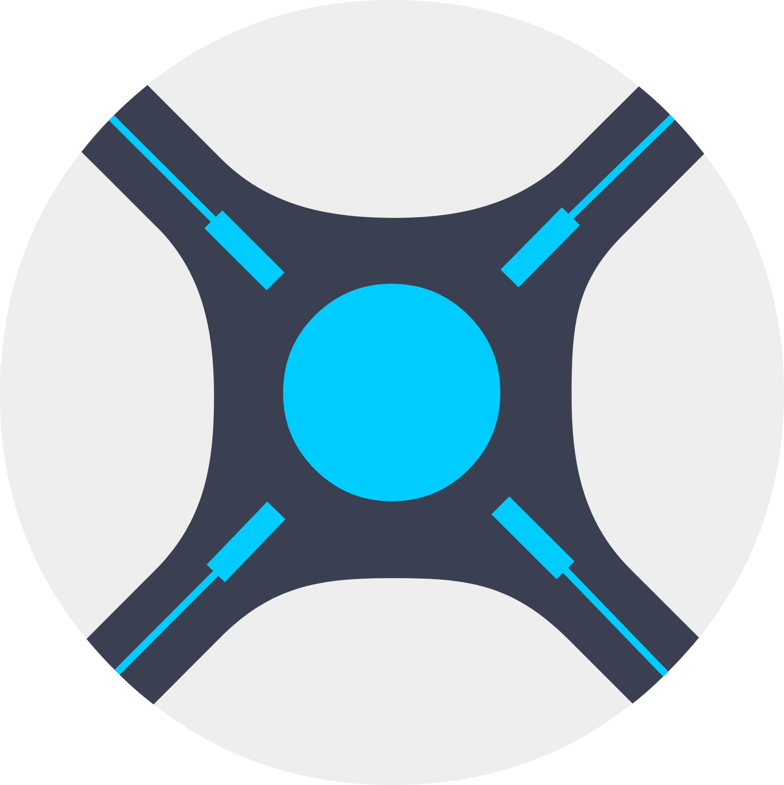

# Control Center

<p align="center">
  
</p>

<p align="center">
  A desktop application built with NativePHP to manage and control media server tools like Sonarr and Radarr.
</p>

## About Control Center

Control Center is a desktop application that provides a unified interface to manage and monitor your media server tools. Built with [NativePHP](https://nativephp.com), it transforms a Laravel web application into a native desktop experience.

### Features

- **Native Desktop Experience**: Runs as a standalone desktop application on your computer
- **Sonarr Integration**: Connect to and manage your Sonarr instance
- **Radarr Integration**: Connect to and manage your Radarr instance
- **Unified Dashboard**: Monitor all your services in one place
- **Modern UI**: Clean, responsive interface built with Vue.js and Tailwind CSS

## What is NativePHP?

[NativePHP](https://nativephp.com) is a framework that allows you to build native desktop applications using Laravel and PHP. It provides:

- Native window management
- System tray integration
- Native menus
- Auto-updates
- Cross-platform compatibility (macOS, Windows, Linux)

Control Center leverages NativePHP to provide a seamless desktop experience while using familiar Laravel and Vue.js technologies.

## Getting Started

### Prerequisites

- PHP 8.1 or higher
- Composer
- Node.js and npm

### Installation

1. Clone the repository:
   ```
   git clone https://github.com/yourusername/control-center.git
   cd control-center
   ```

2. Install PHP dependencies:
   ```
   composer install
   ```

3. Install JavaScript dependencies:
   ```
   npm install
   ```

4. Copy the environment file:
   ```
   cp .env.example .env
   ```

5. Generate an application key:
   ```
   php artisan key:generate
   ```

6. Run the migrations:
   ```
   php artisan migrate
   ```

7. Build the assets:
   ```
   npm run build
   ```

### Running the Application

To run the application in development mode:

```
php artisan native:serve
```

### Building for Production

To build the application for production:

```
php artisan native:build
```

## Configuring Services

### Sonarr

1. Navigate to the Settings page
2. Click on the Sonarr card
3. Enter your Sonarr URL and API key
4. Test the connection
5. Save the configuration

### Radarr

1. Navigate to the Settings page
2. Click on the Radarr card (coming soon)
3. Enter your Radarr URL and API key
4. Test the connection
5. Save the configuration

## Contributing

Contributions are welcome! Please feel free to submit a Pull Request.

## License

This project is open-sourced software licensed under the [MIT license](https://opensource.org/licenses/MIT).
